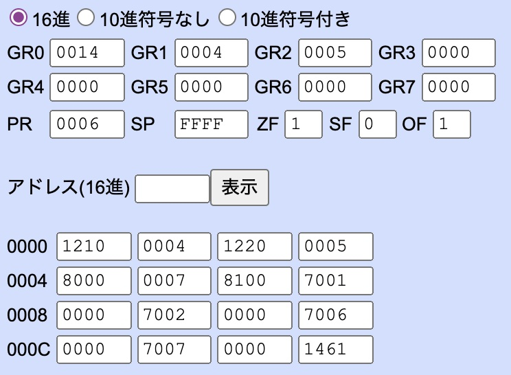

# 4.結果
N(M)はM進数表記におけるNを表す。

## 課題1
下記に示すように、プログラムを実行すると`GR0`に10*`GR2`+`GR3`、つまり
10(10)*1(10) + 8(10) = 18(10) = 12(16)
が格納され、その他のレジスタはサブルーチンが呼び出される前の値であることがわかる。

## 課題2
`GR1`の値は6(16)=6(10)のとき、`GR0`の値は24(16)=36(10)となった。

## 課題3
M=30(10)=1E(16), N=84(10)=54(16)のときNとMの最大公約数は6(10)=6(16)である。

## 課題4
`GR1`にM、`GR2`にN、`GR0`にN*Mが格納されている。
M=5(10)=5(16), N=4(10)=4(16)のとき、M*N=20(10)=14(16)である。

`GR1`にM、`GR2`にN、`GR0`にN*Mが格納されている。
M=-5(10)を32ビットの2の補数に変換し、4バイト16進数表記に変換するとFFFB(16)、N=2(10)=2(16)であるため、M*N=-10(10)。これを2の補数表記の16進数にするとFFF6(16)となる。

## 課題5
`GR1`に3(16), `GR2`に4(16)を入れた時、`GR0`に51(16)=81(10)が代入されている。

