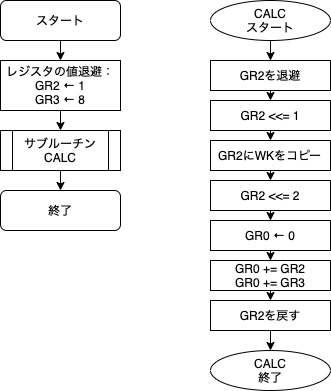

# 1.目的
ハードウェアの理解を深めるため、仮想計算機COMET IIのアセンブリ言語CASL IIを使用したプログラミングを体験する。
# 2.実装

## 課題1

```
EXE1 START
     ;; GR2に1, GR3に8を入れる
     ;; GR2に1, GR3に8を入れる
     LAD GR2,1 ; GR2 <- 1
     LAD GR3,8 ; GR3 <- 8

;;   サブルーチンCALC
     CALL CALC
     RET

CALC PUSH 0,GR2 ;;GR2を退避
     SLA GR2,1  ;; GR2を10倍する処理
     ST GR2,WK
     SLA GR2,2
     ADDA GR2,WK
     ;; GR2+GR3の処理
     LAD GR0,0
     ADDA GR0,GR2
     ADDA GR0,GR3
     ;; GR4,5を戻す
     POP GR2
     RET
WK   DS 1
     END
```

## 課題2

```
EXE2 START
     LAD GR1,6
     CALL CALC
     RET
CALC PUSH 0,GR2
     LD GR2,GR1
     SLA GR2,1
     SUBA GR2,=1 
     LD GR0,=0
LOOP ADDA GR0,GR2
     SUBA GR2,=2
     JPL LOOP
     POP GR2
     RET
     END
```

## 課題3

```
EXE3 START
     LAD GR1,30 ;; M
     LAD GR2,84 ;; N
     CALL CALC
     RET

CALC PUSH 0,GR3  ;; 作業領域確保  WKM
     PUSH 0,GR4  ;;             WKN             
     LD GR3,GR1  ;; MをWKMにコピー
     LD GR4,GR2  ;; NをWKNにコピー
     LAD GR0,0   ;;0でリセット
FIVE CPA GR3,GR4 ;;(>)...
     JZE TEN     ;; 等しければ10
     JPL NINE    ;; WKM > WKNであれば 9
     ;;;elsif 引き算
     SUBA GR4,GR3
     JUMP FIVE

     RET

NINE SUBA GR3,GR4
     JUMP FIVE

TEN LD GR0,GR4
     ;; 作業領域の復元
     POP GR4
     POP GR3
     RET
     END
```

## 課題4

```
EXE4  START
      LAD GR1,-3 ;; M
      LAD GR2,2 ;; N
      CALL MULT
      RET

;; 掛け算サブルーチン
MULT  PUSH 0,GR1  ;; オリジナルの値待避
      PUSH 0,GR2
      PUSH 0,GR6  ;; wkM 作業領域確保  WKM
      PUSH 0,GR7  ;; wkN             WKN             
      LD GR6,GR1  ;; MをWKMにコピー
      LD GR7,GR2  ;; NをWKNにコピー
      LAD GR0,0   ;; 0でリセット
FIVE  LAD GR1,1   ;; GR1に1
      AND GR1,GR7 ;; GR1 &= GRwkN
      JZE EIGHT   ;; 前述の演算結果が0であれば8に
      ADDA GR0,GR6 ;; GR0+=GRwkM
EIGHT SLA GR6,1     ;; GRwkM <<= 1
      SRA GR7,1     ;; GRwkN >>= 1
      JNZ FIVE    ;; GRwkMがノンゼロであればもどる
      ;;;;; ワーキングメモリの解放
      POP GR7      
      POP GR6
      POP GR2
      POP GR1
      RET
;; サブルーチンここまで
      END

```

## 課題5

```
EXE5  START
      LAD GR1,3 ;; x
      LAD GR2,4 ;; y
      CALL POW
      RET

;; 冪乗サブルーチン
;;    基数(x)    : GR1
;;    冪数(y)    : GR2
;;    カウンタ(y) : GR5 初期値y(GR2)

POW   PUSH 0,GR5  ;; カウンタレジスタ待避
      PUSH 0,GR1  ;; オリジナルの値待避
      PUSH 0,GR2 
      LD GR5,GR2  ;; カウンタ <- y
      LD GR2,GR1  ;; GR2(N) <- x
      LAD GR1,1   ;; GR1(M) <- 1
FOUR  CALL MULT   ;; GR0 = GR1
      LD GR1,GR0  ;; GR1(M) = MULTの結果
      SUBA GR5,=1 ;; カウンタ(GR5)を1減らす
      JPL FOUR    ;; カウンタ>0であれば4にジャンプ
      ;; 退避した値を戻す
     
      POP GR2      
      POP GR1
      POP GR5
      RET
;; ここまで

;; 掛け算サブルーチン
MULT  PUSH 0,GR1  ;; オリジナルの値待避
      PUSH 0,GR2
      PUSH 0,GR6  ;; wkM 作業領域確保  WKM
      PUSH 0,GR7  ;; wkN             WKN             
      LD GR6,GR1  ;; MをWKMにコピー
      LD GR7,GR2  ;; NをWKNにコピー
      LAD GR0,0   ;; 0でリセット
FIVE  LAD GR1,1   ;; GR1に1
      AND GR1,GR7 ;; GR1 &= GRwkN
      JZE EIGHT   ;; 前述の演算結果が0であれば8に
      ADDA GR0,GR6 ;; GR0+=GRwkM
EIGHT SLA GR6,1     ;; GRwkM <<= 1
      SRA GR7,1     ;; GRwkN >>= 1
      JNZ FIVE    ;; GRwkMがノンゼロであればもどる
      ;;;;; ワーキングメモリの解放
      POP GR7      
      POP GR6
      POP GR2
      POP GR1
      RET
;; サブルーチンここまで
      END
```

# 3.解説

## 課題1
下に示すフローチャートの通りである。



## 課題2
下に示すフローチャートの通りである。


## 課題3
下に示すフローチャートの通りである。


# 4.結果
N(M)はM進数表記におけるNを表す。

## 課題1
下記に示すように、プログラムを実行すると`GR0`に10*`GR2`+`GR3`、つまり
10(10)*1(10) + 8(10) = 18(10) = 12(16)
が格納され、その他のレジスタはサブルーチンが呼び出される前の値であることがわかる。


## 課題2
`GR1`の値は6(16)=6(10)のとき、`GR0`の値は24(16)=36(10)となった。


## 課題3
M=30(10)=1E(16), N=84(10)=54(16)のときNとMの最大公約数は6(10)=6(16)である。


## 課題4
`GR1`にM、`GR2`にN、`GR0`にN*Mが格納されている。
M=5(10)=5(16), N=4(10)=4(16)のとき、M*N=20(10)=14(16)である。


`GR1`にM、`GR2`にN、`GR0`にN*Mが格納されている。
M=-5(10)を32ビットの2の補数に変換し、4バイト16進数表記に変換するとFFFB(16)、N=2(10)=2(16)であるため、M*N=-10(10)。これを2の補数表記の16進数にするとFFF6(16)となる。


## 課題5
`GR1`に3(16), `GR2`に4(16)を入れた時、`GR0`に51(16)=81(10)が代入されている。


# 5.低水準言語の需要
低水準言語は、たとえばPythonやJavaなどの高水準な言語と比較して記述方法や実行方法がコンピュータが直接解釈するフォーマットに近いため、プログラムの解釈のためのオーバーヘッドが少なく実行速度が非常に速いことが特徴である。
そのため、高速な演算を要求される場面やコンピュータハードウェアを直接検査したい場合に用いられる場合がある。(参考文献1)
# 結論
アセンブリ言語によるプログラミングは、レジスタがその行において何に使用されているか厳密に把握する必要があり、なぜC言語などの高水準言語が必要とされたのか実感した。


# 参考文献
1. [情報概論資料/プログラム言語](https://lecture.ecc.u-tokyo.ac.jp/~anori3/Rice01/Programming.pdf)